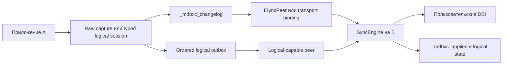
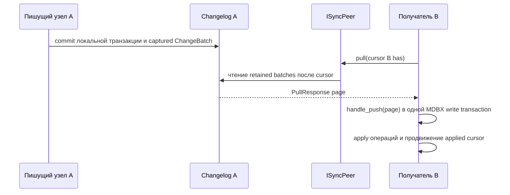

# Sync-репликация

`mdbx-containers` предоставляет подключаемую подсистему репликации для
приложений на MDBX. Она не привязана к транспорту: ядро отвечает за capture,
постоянное состояние, постраничную выдачу, проверку и apply-транзакции, а
приложение выбирает реализацию `ISyncPeer` либо один из опциональных HTTP/
WebSocket binding.

Это вводная страница для разработчика приложения. Здесь описан реализованный
контракт. Решения, влияющие на wire- и disk-форматы, отдельно зафиксированы в
[`include/mdbx_containers/sync/DESIGN.md`](../include/mdbx_containers/sync/DESIGN.md).

English version: [sync.md](sync.md).

## Выбор режима

| Задача | Режим | Точки входа |
| --- | --- | --- |
| Реплицировать обычные записи таблиц между копиями БД | Raw-репликация | `ThreadLocalChangeAccumulator`, `SyncCaptureScope`, `SyncWorker`, `ISyncPeer` |
| Реплицировать таблицу через явную типизированную схему приложения | Logical frames | Logical adapter таблицы, `LogicalChangeFrameCodec`, `SyncEngine::apply_logical_frame_bytes()` |
| Сохранить одну авторитетную упорядоченную историю и безопасно повторять её доставку | Ordered logical delivery | Durable outbox, logical-capable `ISyncPeer`, `SyncWorkerOptions::enable_logical_delivery` |
| Восстановить свежую raw-реплику после удаления нужной истории из changelog | Full snapshot recovery | `SyncWorkerOptions::enable_full_snapshot_fallback`, `CompleteUserDatabase` |

Эти режимы намеренно разделены. Обычный pull/push transport protocol несёт
только raw DBI operations. Ordered logical delivery использует отдельный
capability-negotiated protocol и явно включается в `SyncWorker`; он не
преобразуется молча в raw операции и не попадает в обычный `ChangeBatch`.
Direct logical frames остаются application-delivered, когда routing, порядок и
retry policy принадлежат самому приложению.

## Основные понятия

- **NodeId** идентифицирует одного постоянного участника репликации. Его нужно
  сгенерировать один раз, сохранить вместе с узлом и повторно использовать
  после перезапуска.
- **DbId** идентифицирует одну логическую реплицируемую БД. У всех участников
  этого набора репликации он должен совпадать.
- **Origin sequence** упорядочивает raw batches одного узла. Получатель хранит
  applied cursor для каждого origin и принимает только непрерывные новые
  последовательности.
- **Capture** записывает поддерживаемые локальные изменения в той же
  транзакции, которая их сделала. При локальном commit он не связывается с
  удалённым узлом.
- **Apply** - это MDBX-транзакция получателя, проверяющая и фиксирующая
  полученную страницу, после чего продвигается durable cursor.

## Архитектура



Две стрелки в `EngineB` означают разные admission paths. Raw-страница идёт
через `handle_push()`. Direct logical frame использует явный logical apply
method. Ordered envelope проходит через logical peer protocol; дополнительно
проверяются destination, порядок origin, replay state и persistent schema
marker.

## Raw-репликация

Включите sync до подключения sync umbrella:

```cpp
#define MDBXC_SYNC_ENABLED 1
#include <mdbx_containers/sync.hpp>
```

Обычная настройка создаёт `SyncEngine` для каждого connection, инициализирует
постоянную local identity, подключает `ThreadLocalChangeAccumulator` на
writer'ах и запускает `SyncWorker` на получателях. `SyncNodeSession` объединяет
типичный application lifecycle: подключение capture и запуск уже созданного
worker.



Одиночная поддерживаемая запись создаёт один local batch. Несколько
поддерживаемых записей в явной connection-managed transaction создают один
атомарный local batch. Ошибочные или откатанные транзакции batch не создают.

Когда capture подключён, операции записи должны использовать `Transaction`
либо `Connection::begin()` / `commit()`. Writable `MDBX_txn*`, созданные самим
вызывающим кодом, отклоняются до mutation: они не могут вызвать capture
pre-commit hook. Read-only handles вызывающего кода остаются пригодными для
чтения и snapshot operations.

### Поддержка raw-репликации

| Семейство таблиц | Raw-статус | Важная граница |
| --- | --- | --- |
| `KeyValueTable`, `KeyTable`, `ValueTable`, `SequenceTable` | Поддерживается | Операции захватываются как физические изменения DBI. |
| `VectorStore` | Поддерживается через owned tables | Raw-репликация обновляет четыре underlying DBI; уже открытые экземпляры лениво пересобирают in-memory index после remote apply. |
| `KeyMultiValueTable` | Не реплицируется как raw | Используйте явный logical adapter, если подходит его documented typed contract. |
| `KeyOrderedMultiValueTable` | Не реплицируется как raw | Для поддерживаемых схем используйте ordered logical delivery. |
| `AnyValueTable`, `HashedKeyValueStore` | Отложено | Контракта raw capture пока нет. |

Raw-репликация сохраняет contract операций на уровне storage. Это не общая
система conflict resolution. Текущий engine отклоняет sequence gaps и не даёт
last-writer-wins policy для конкурентных изменений приложения одних и тех же
логических данных.

## Транспорт и эксплуатация

`DirectSyncPeer` - in-process peer для вводных примеров. Framework-neutral
HTTP- и WebSocket-seams используют `TransportMessageCodec`; опциональные
Simple-Web и Kurlyk bindings дают concrete transport, не меняя core messages.

### Упорядоченная логическая доставка

`ISyncPeer` также имеет optional logical-delivery capability. Его реализуют
`DirectSyncPeer`, `HttpSyncPeer` и `WebSocketSyncPeer`. HTTP использует
отдельные logical hello и delivery routes; WebSocket определяет logical
protocol по собственному magic. Ни `TransportMessageCodec`, ни raw pull/push
wire layout при этом не меняются.

Установите `SyncWorkerOptions::enable_logical_delivery = true`, чтобы worker
после полного raw pull round отправлял durable outbox local engine. В качестве
logical destination используется текущий replication `DbId`; worker
согласует ordered delivery и cumulative acknowledgements и удаляет только
acknowledged outbox prefix. `max_logical_deliveries` при необходимости
ограничивает один round; ноль означает отправить весь pending prefix. Raw-only
peer допускается, пока outbox пуст, но при pending delivery round завершается
ошибкой без удаления queued frames. Retryable acknowledgement failure также
сохраняет unacknowledged suffix для следующего round.

Transport authentication, TLS, remote-address policy, rate limiting, request
id и HTTP/WebSocket status mapping остаются на стороне adapter. Они намеренно
не сериализуются в replication DTO. Настройка эксплуатации описана в
[sync-transport-production.md](../guides/sync-transport-production.md).

Полезные runnable starting points:

- [`sync_01_lifecycle_direct_peer.cpp`](../examples/sync_01_lifecycle_direct_peer.cpp): один ручной raw pull/push cycle.
- [`sync_22_node_session_minimal.cpp`](../examples/sync_22_node_session_minimal.cpp): минимальная wiring-схема `SyncNodeSession`.
- [`sync_07_worker_observer.cpp`](../examples/sync_07_worker_observer.cpp): status и callbacks worker'а.

## Дальнейшее чтение

- [Практические схемы развёртывания](sync-deployment-patterns-RU.md): модели
  данных и ownership writers для multi-origin datasets.
- [Logical и ordered delivery](sync-logical-RU.md): typed schemas, adapter
  capture, ordered outbox delivery и границы concurrency.
- [Восстановление и full snapshots](sync-recovery-RU.md): recovery retained
  history, snapshot scopes и правила fresh replica.
- [Матрица покрытия таблиц sync](../guides/sync-table-coverage.md): точный
  уровень поддержки операций и отложенная работа.
- [Примеры sync](../examples/README-sync-RU.md): команды сборки и порядок
  изучения примеров.
