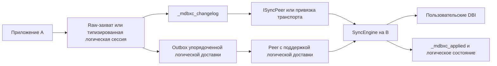
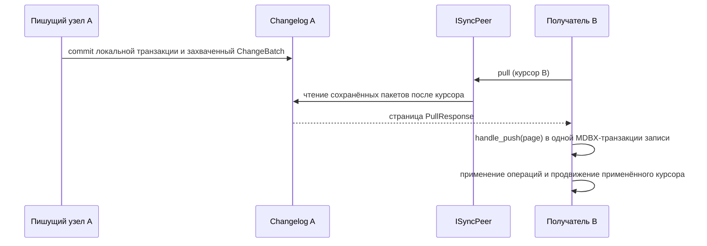

# Sync-репликация

`mdbx-containers` предоставляет подключаемую подсистему репликации для
приложений на MDBX. Она не привязана к транспорту: ядро отвечает за захват,
постоянное состояние, постраничную выдачу, проверку и транзакции применения, а
приложение выбирает реализацию `ISyncPeer` либо одну из подключаемых привязок
HTTP/WebSocket.

Это вводная страница для разработчика приложения. Здесь описан реализованный
контракт. Решения, влияющие на сетевой и дисковый форматы, отдельно зафиксированы в
[`include/mdbx_containers/sync/DESIGN.md`](../include/mdbx_containers/sync/DESIGN.md).

Английская версия: [sync.md](sync.md).

## Выбор режима

| Задача | Режим | Точки входа |
| --- | --- | --- |
| Реплицировать обычные записи таблиц между копиями БД | Raw-репликация | `ThreadLocalChangeAccumulator`, `SyncCaptureScope`, `SyncWorker`, `ISyncPeer` |
| Разрешать один изменяемый ключ по версии источника | Узкий LWW-регистр | `ConflictPolicy::LastWriterWins`, `VersionedKeyValueTable` |
| Реплицировать таблицу через явную типизированную схему приложения | Логические фреймы | Логический адаптер таблицы, `LogicalChangeFrameCodec`, `SyncEngine::apply_logical_frame_bytes()` |
| Сохранить единую упорядоченную историю от назначенного origin и безопасно повторять её доставку | Упорядоченная логическая доставка | Постоянный outbox, `ISyncPeer` с логической доставкой, `SyncWorkerOptions::enable_logical_delivery` |
| Восстановить свежую raw-реплику после удаления нужной истории из журнала | Восстановление полным снимком | `SyncWorkerOptions::enable_full_snapshot_fallback`, `CompleteUserDatabase` |

Эти режимы намеренно разделены. Обычный транспортный протокол pull/push несёт
только raw-операции DBI. Упорядоченная логическая доставка использует отдельный
протокол с согласованием возможностей и явно включается в `SyncWorker`; она не
преобразуется молча в raw-операции и не попадает в обычный `ChangeBatch`.
Прямые логические фреймы доставляет само приложение, когда ему принадлежат
маршрутизация, порядок и политика повторов.

## Основные понятия

- **NodeId** идентифицирует одного постоянного участника репликации. Его нужно
  сгенерировать один раз, сохранить вместе с узлом и повторно использовать
  после перезапуска.
- **DbId** идентифицирует одну логическую реплицируемую БД. У всех участников
  этого набора репликации он должен совпадать.
- **Последовательность origin** упорядочивает raw-пакеты одного узла. Получатель хранит
  применённый курсор для каждого origin и принимает только непрерывные новые
  последовательности.
- **Захват** записывает поддерживаемые локальные изменения в той же
  транзакции, которая их сделала. При локальном commit он не связывается с
  удалённым узлом.
- **Применение** — это MDBX-транзакция получателя, проверяющая и фиксирующая
  полученную страницу, после чего продвигается постоянный курсор.

## Архитектура



Две стрелки в `EngineB` означают разные пути допуска. Raw-страница идёт через
`handle_push()`. Прямой логический фрейм использует явный метод применения.
Упорядоченный envelope проходит через протокол logical peer; дополнительно
проверяются получатель, порядок origin, состояние повтора и постоянный маркер
схемы.

## Raw-репликация

Включите sync до подключения sync umbrella:

```cpp
#define MDBXC_SYNC_ENABLED 1
#include <mdbx_containers/sync.hpp>
```

Обычная настройка создаёт `SyncEngine` для каждого соединения, инициализирует
постоянную локальную идентичность, подключает `ThreadLocalChangeAccumulator`
на пишущих узлах и запускает `SyncWorker` на получателях. `SyncNodeSession`
объединяет типичный жизненный цикл приложения: подключение захвата и запуск уже
созданного worker.



Одиночная поддерживаемая запись создаёт один локальный пакет. Несколько
поддерживаемых записей в явной транзакции под управлением соединения создают
один атомарный локальный пакет. Ошибочные или откатанные транзакции пакет не создают.

Когда capture подключён, операции записи должны использовать `Transaction`
либо `Connection::begin()` / `commit()`. Writable `MDBX_txn*`, созданные самим
вызывающим кодом, отклоняются до мутации: они не могут вызвать hook захвата до
commit. Дескрипторы только для чтения, созданные вызывающим кодом, остаются
пригодными для чтения и операций снимка.

### Поддержка raw-репликации

| Семейство таблиц | Raw-статус | Важная граница |
| --- | --- | --- |
| `KeyValueTable`, `KeyTable`, `ValueTable`, `SequenceTable` | Поддерживается | Операции захватываются как физические изменения DBI. |
| `VersionedKeyValueTable` | Узкий LWW v1-адаптер | Только точечные versioned put/delete для регистра «побеждает версия источника». |
| `VectorStore` | Поддерживается через принадлежащие таблицы | Raw-репликация обновляет четыре внутренние DBI; уже открытые экземпляры лениво пересобирают индекс в памяти после удалённого применения. |
| `KeyMultiValueTable` | Не реплицируется как raw | Используйте явный логический адаптер, если подходит его документированный типизированный контракт. |
| `KeyOrderedMultiValueTable` | Не реплицируется как raw | Для поддерживаемых схем используйте упорядоченную логическую доставку. |
| `AnyValueTable`, `HashedKeyValueStore` | Отложено | Контракта raw-захвата пока нет. |

Raw-репликация сохраняет контракт операций на уровне хранения и отклоняет
пропуски последовательности. Узкое исключение для конкурентных записей —
регистр `VersionedKeyValueTable`: с `ConflictPolicy::LastWriterWins` каждая
точечная put/delete-операция несёт непустимую версию, принадлежащую приложению,
которая сравнивается лексикографически, затем по `NodeId` origin. Версия
остаётся вне значения пользователя, а постоянный tombstone не позволяет старому
put воскресить delete.

Это не универсальное разрешение конфликтов. `VersionedKeyValueTable` постоянно
регистрирует только свой DBI; каждая реплика должна сконструировать адаптер до
приёма операций с версией источника. Зарегистрированный DBI принимает только точечные
put/delete-изменения, созданные адаптером, и отклоняет прямые raw-записи, clear,
пакетные и диапазонные записи. Обычные raw DBI могут сосуществовать на том же
LWW engine и принимать raw-операции без версии. Полные снимки могут использовать
manifest обычных DBI, но не могут включать зарегистрированный DBI. Выберите
последовательность источника либо другой канонический порядок; часы узла его не
задают. Эксплуатационная модель приведена в
[схемах развёртывания](sync-deployment-patterns-RU.md).

## Транспорт и эксплуатация

`DirectSyncPeer` — peer в одном процессе для вводных примеров. Независимые от
фреймворка стыки HTTP и WebSocket используют `TransportMessageCodec`;
подключаемые привязки Simple-Web и Kurlyk дают конкретный транспорт, не меняя
сообщения ядра.

### Упорядоченная логическая доставка

`ISyncPeer` также имеет подключаемую возможность логической доставки. Её
реализуют `DirectSyncPeer`, `HttpSyncPeer` и `WebSocketSyncPeer`. HTTP
использует отдельные маршруты logical hello и доставки; WebSocket определяет
логический протокол по собственному magic. Ни `TransportMessageCodec`, ни
сетевой формат raw pull/push при этом не меняются.

Установите `SyncWorkerOptions::enable_logical_delivery = true`, чтобы worker
после полного raw-обхода pull отправлял постоянный outbox локального engine. В
качестве логического получателя используется текущий `DbId` репликации; worker
согласует упорядоченную доставку и накопительные подтверждения и удаляет только
подтверждённый префикс outbox. `max_logical_deliveries` при необходимости
ограничивает один обход; ноль означает отправить весь ожидающий префикс. Peer
только с raw-доставкой допускается, пока outbox пуст, но при ожидающей доставке
обход завершается ошибкой без удаления фреймов из очереди. Ошибка подтверждения,
допускающая повтор, также сохраняет неподтверждённый суффикс для следующего обхода.

Аутентификация транспорта, TLS, политика удалённого адреса, ограничение частоты,
id запроса и сопоставление статусов HTTP/WebSocket остаются на стороне адаптера.
Они намеренно не сериализуются в DTO репликации. Настройка эксплуатации описана в
[sync-transport-production.md](../guides/sync-transport-production.md).

Полезные рабочие примеры:

- [`sync_01_lifecycle_direct_peer.cpp`](../examples/sync_01_lifecycle_direct_peer.cpp): один ручной цикл raw pull/push.
- [`sync_22_node_session_minimal.cpp`](../examples/sync_22_node_session_minimal.cpp): минимальная схема подключения `SyncNodeSession`.
- [`sync_07_worker_observer.cpp`](../examples/sync_07_worker_observer.cpp): состояние и callbacks worker.

## Дальнейшее чтение

- [Сценарии использования sync](sync-use-cases-RU.md): выбор поддерживаемого
  контракта для одного пишущего узла, неизменяемых событий нескольких origin,
  LWW-регистров и корпуса RAG.
- [Практические схемы развёртывания](sync-deployment-patterns-RU.md): модели
  данных и владение записями для наборов данных с несколькими origin.
- [Логическая и упорядоченная доставка](sync-logical-RU.md): типизированные
  схемы, захват адаптера, доставка из упорядоченного outbox и границы конкурентности.
- [Восстановление и полные снимки](sync-recovery-RU.md): восстановление
  сохранённой истории, области снимков и правила свежей реплики.
- [Матрица покрытия таблиц sync](../guides/sync-table-coverage.md): точный
  уровень поддержки операций и отложенная работа.
- [Примеры sync](../examples/README-sync-RU.md): команды сборки и порядок
  изучения примеров.
