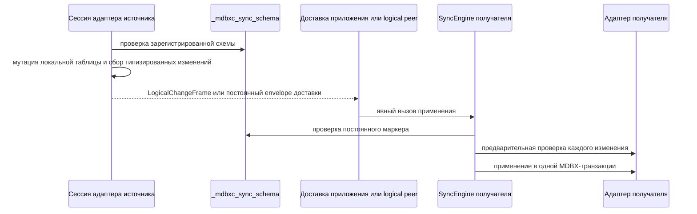
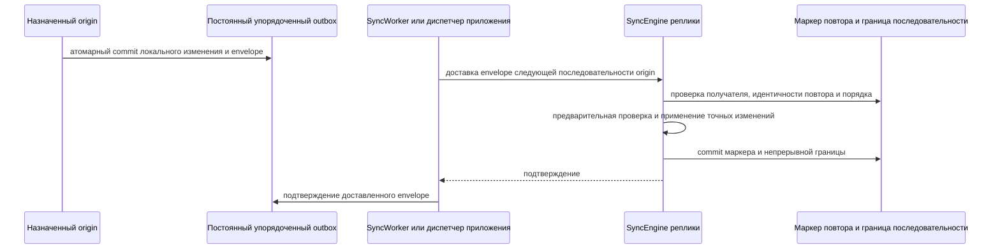

# Логическая и упорядоченная синхронизация

Логическая синхронизация — подключаемый протокол уровня приложения для таблиц,
чью публичную семантику нельзя безопасно выразить raw-операциями MDBX put и
delete. Он использует явный маркер схемы и нагрузку, принадлежащую адаптеру. Он
не входит в обычный сетевой путь raw `PullRequest` / `PushRequest`.

Сначала прочитайте [Sync-репликация](sync-RU.md). Английская версия:
[sync-logical.md](sync-logical.md).

## Жизненный цикл

1. Выберите стабильные `schema_id` приложения, вид логической таблицы, версию
   схемы, теги кодека и полный набор имён принадлежащих DBI.
2. Инициализируйте или проверьте маркер схемы через `SyncEngine`. Существующий
   маркер проверяется, а не пересоздаётся как неявное восстановление.
3. Создайте соответствующие адаптеры на источнике и получателе. Зарегистрируйте
   адаптер получателя в его `SyncEngine`.
4. Выполняйте записи источника через типизированную сессию захвата адаптера.
   Успешный commit сессии публикует логические изменения только после успешной
   мутации локальной таблицы.
5. Доставляйте `LogicalChangeFrame` через протокол приложения либо фиксируйте
   упорядоченный envelope в постоянном outbox через `commit_to_outbox()`.
   `SyncWorkerOptions::enable_logical_delivery` отправляет второй вариант через
   peer с поддержкой логической доставки после полного raw-обхода pull.
6. Применяйте изменения на получателе соответствующим методом `SyncEngine`.
   Проверка маркера и предварительная проверка адаптера происходят до его
   мутации; ошибки откатывают транзакцию, которой владеет engine.

Маркер схемы хранит id схемы приложения, вид, версию, основной DBI и набор
принадлежащих DBI. Он защищает получателя от принятия устаревшего адаптера в
памяти после миграции маркера. Смена семантики кодека, версии схемы или
принадлежащего DBI требует новой идентичности схемы либо явной совместимой
миграции; обычная регистрация не перезаписывает существующий несовместимый маркер.

## Прямые логические фреймы

`LogicalChangeFrameCodec` сериализует явный набор логических изменений.
`SyncEngine::apply_logical_frame_bytes()` применяет его на получателе. Этот
маршрут подходит, когда приложение уже владеет маршрутизацией получателя,
порядком доставки и политикой повторов.

Сам по себе он намеренно не является безопасным для повторов упорядоченным
транспортом. У фрейма нет идентичности получателя, глобального порядка и
постоянной идентичности повтора. Его нельзя использовать как неявную замену raw
pull/push или envelope упорядоченной доставки.

Рабочий пример [`sync_23_key_value_logical_frame.cpp`](../examples/sync_23_key_value_logical_frame.cpp)
показывает полный путь захвата, кодирования, декодирования и применения адаптера
`KeyValueTable`.

## Упорядоченная логическая доставка

`KeyOrderedMultiValueTable` использует другой маршрут, потому что наблюдаемый
порядок append является частью его API. Прямой логический фрейм и
неупорядоченная доставка отклоняются. Маркер схемы называет один ненулевой
назначенный origin.

Получатель считает повторную доставку уже зафиксированного envelope успешным
no-op. Пропуск либо несовпадающий origin отклоняется до мутации таблицы. Outbox
отправителя позволяет приложению повторить доставку после сбоя процесса или
транспорта, не теряя локальную упорядоченную историю, зафиксированную вместе с
envelope.

Каждая упорядоченная отправка адресуется ровно одному узлу-получателю. Сетевой
`DeliveryRequest` связывает id получателя с envelope, а получатель проверяет
его до повтора, границы последовательности и работы адаптера; acknowledgement
повторяет фактический id получателя. HTTP и WebSocket принимают для
упорядоченной доставки только такой запрос, привязанный к получателю. Устаревшее
сообщение только с envelope
`Delivery` не является сетевым маршрутом упорядоченной доставки.

В v0.1 один commit сессии захвата атомарно публикует envelope для одного
получателя. Атомарная рассылка нескольким получателям и реестр peer отложены.
Записи outbox всегда укладываются в ограничения кодека библиотеки по умолчанию,
поэтому поздно запущенный worker декодирует их без ограничений вызывающего кода.

`origin_sequence` идентифицирует одно логическое событие для его origin и БД;
он не выделяется заново для другого получателя. Ожидающая доставка и состояние
подтверждений остаются специфичными для получателя. Перед переносом маршрута
v0.1 на новую реплику восстановите её из текущего получателя, чтобы она
импортировала границу последовательности origin. Иначе первая новая доставка
будет отклонена из-за пропуска последовательности.

Для `DirectSyncPeer`, `HttpSyncPeer` и `WebSocketSyncPeer` этот диспетчер может
предоставить подключаемый проход логической доставки worker. Он запускается
только при `SyncWorkerOptions::enable_logical_delivery = true`, только после
полного raw-обхода pull и только для текущего `DbId` worker. Peer сначала
согласует упорядоченную доставку и накопительное подтверждение. Каждый
подтверждённый префикс постоянно удаляется из outbox отправителя; peer без
поддержки, пропуск последовательности или ошибка подтверждения, допускающая
повтор, сохраняют неподтверждённый суффикс в очереди. `max_logical_deliveries`
ограничивает обход при необходимости, а ноль отправляет весь ожидающий префикс.
Этот протокол остаётся отдельным от raw `PullRequest` / `PushRequest`.

Смена назначенного origin — переключение, координируемое приложением. Приложение
должно остановить старый захват, доставить старый outbox, сохранить состояние
повтора на свой горизонт повторов, мигрировать маркер на всех участниках и
только затем включить новый origin. Это не автоматическое переключение и не делает два origin
одновременно допустимыми для одного ordered dataset.

## Реализованные контракты адаптеров

| Адаптер | Реализованный типизированный контракт | Граница |
| --- | --- | --- |
| `KeyValueTableLogicalAdapter` | Явный типизированный захват и применение; `commit_to_outbox()` атомарно публикует упорядоченный envelope. | Прямые фреймы остаются ручными; доставка из упорядоченного outbox требует peer с поддержкой. |
| `KeyTableLogicalAdapter` | Явный типизированный захват и применение; `commit_to_outbox()` атомарно публикует упорядоченный envelope. | Прямые фреймы остаются ручными; доставка из упорядоченного outbox требует peer с поддержкой. |
| `VectorStoreLogicalAdapter` | Схема v1: add, erase и clear по id DBI, embedding, тексту и метаданным. Явные id проверяются до мутации; `commit_to_outbox()` атомарен. | Один назначенный либо внешне сериализованный пишущий узел на коллекцию. |
| `KeyMultiValueTableLogicalAdapter` | v1: insert, нейтральный к версии пакетный `append()`, удаление ключа, всех совпадающих значений и clear. v2 добавляет удаление ровно одного значения и `reconcile()`. v3 добавляет ограниченный типизированный `erase_range()`, разложенный в точные удаления ключей. `commit_to_outbox()` атомарен. | Семантика неупорядоченного мультимножества; один пишущий узел либо причинно сериализованные разрушающие обновления. |
| `KeyOrderedMultiValueTableLogicalAdapter` | v1: упорядоченная доставка только `append()`. | Один назначенный origin. |
| `KeyOrderedMultiValueTableDestructiveLogicalAdapter` | v2: точные append/erase по постоянному id элемента, ограниченное удаление селектором, clear и `replace_with()` одного origin. | Один назначенный origin; импорт baseline, история нескольких origin и уплотнение tombstone отложены. |

Для `KeyMultiValueTable` повторяющиеся одинаковые пары образуют мультимножество:
кратность сохраняется, но локальный порядок обхода повторов не является
межузловой гарантией. Прямые вызовы таблицы, raw-захват и неподдерживаемые
пакетные пути остаются только локальными. Для `KeyOrderedMultiValueTable`
физический локальный префикс повтора не является распределённой идентичностью;
источником порядка истории служит упорядоченный envelope.

## Правила ошибок и конкурентности

- Ошибки проверки, планирования или кодирования до мутации оставляют
  типизированную сессию захвата активной, если адаптер явно не документирует
  ошибку целостности хранилища как фатальную для сессии.
- Когда ошибка захвата или применения происходит после мутации, затронутый
  engine или сессия откатывает MDBX-транзакцию и отклоняет дальнейший commit там,
  где его контракт требует деактивации.
- Общего контракта сходимости разрушающих логических обновлений от нескольких
  пишущих узлов нет. Используйте одного назначенного пишущего узла для логического
  набора данных либо внешне сериализуйте конфликтующие изменения до доставки.
- Логические хранилища содержат постоянное состояние совместимости и доставки.
  Не изменяйте `_mdbxc_sync_schema`, маркеры повтора, упорядоченные границы либо
  записи outbox через вызовы MDBX приложения.

## Дальнейшее чтение

- [Восстановление и полные снимки](sync-recovery-RU.md) объясняет, почему raw
  полный снимок не может восстановить БД с постоянным состоянием logical-sync.
- [Матрица покрытия таблиц sync](../guides/sync-table-coverage.md) содержит
  исчерпывающую матрицу операций и отложенных границ.
