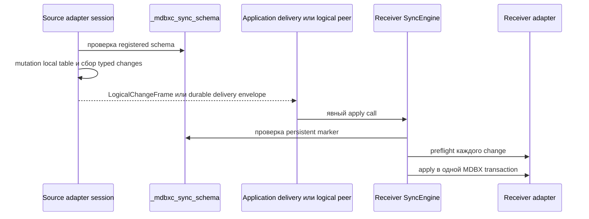
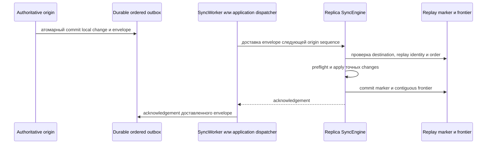

# Логическая и упорядоченная синхронизация

Logical sync - это opt-in application-owned protocol для таблиц, чью публичную
семантику нельзя безопасно выразить raw MDBX puts и deletes. Он использует
явный schema marker и payloads, принадлежащие adapter'у. Он не входит в обычный
raw `PullRequest` / `PushRequest` wire path.

Сначала прочитайте [Sync-репликация](sync-RU.md). English version:
[sync-logical.md](sync-logical.md).

## Жизненный цикл

1. Выберите стабильные application `schema_id`, logical table kind, schema
   version, codec tags и полный набор owned DBI names.
2. Инициализируйте или проверьте schema marker через `SyncEngine`. Существующий
   marker проверяется, а не пересоздаётся как неявное восстановление.
3. Создайте соответствующие adapters на source и destination. Зарегистрируйте
   destination adapter в destination `SyncEngine`.
4. Выполняйте записи source через typed capture session adapter'а. Успешный
   session commit публикует logical changes только после успешной local table
   mutation.
5. Доставляйте `LogicalChangeFrame` через application protocol либо коммитьте
   ordered envelope в durable outbox через `commit_to_outbox()`.
   `SyncWorkerOptions::enable_logical_delivery` отправляет второй вариант через
   logical-capable peer после полного raw pull round.
6. Применяйте изменения на destination соответствующим методом `SyncEngine`.
   Marker validation и adapter preflight происходят до mutation adapter'а;
   ошибки откатывают engine-owned transaction.

Schema marker хранит application schema id, kind, version, primary DBI и owned
DBI set. Он защищает получателя от принятия stale in-memory adapter после marker
migration. Смена codec semantics, schema version или owned DBI требует новой
schema identity либо явной совместимой migration; обычная registration не
перезаписывает существующий несовместимый marker.

## Прямые логические фреймы

`LogicalChangeFrameCodec` сериализует явный набор logical changes.
`SyncEngine::apply_logical_frame_bytes()` применяет его на получателе. Этот
маршрут подходит, когда приложение уже владеет destination routing, delivery
order и retry policy.

Сам по себе он намеренно не является retry-safe ordered transport. У frame нет
destination identity, global order и durable replay identity. Его нельзя
использовать как неявную замену raw pull/push или ordered-delivery envelope.

Runnable example [`sync_23_key_value_logical_frame.cpp`](../examples/sync_23_key_value_logical_frame.cpp)
показывает полный capture, encode, decode и apply path для adapter'а
`KeyValueTable`.

## Упорядоченная логическая доставка

`KeyOrderedMultiValueTable` использует другой маршрут, потому что наблюдаемый
порядок append является частью его API. Direct logical frame и unordered
delivery отклоняются. Schema marker называет один ненулевой authoritative
origin.

Получатель считает committed redelivery успешным no-op. Gap либо mismatched
origin отклоняется до table mutation. Sender outbox позволяет приложению
повторить доставку после process или transport failure, не теряя local ordered
history, закоммиченную вместе с envelope.

Для `DirectSyncPeer`, `HttpSyncPeer` и `WebSocketSyncPeer` этот dispatcher может
предоставить optional logical-delivery pass worker'а. Он запускается только при
`SyncWorkerOptions::enable_logical_delivery = true`, только после полного raw
pull round и только для текущего `DbId` worker'а. Peer сначала согласует ordered
delivery и cumulative acknowledgement. Каждый acknowledged prefix durably
удаляется из sender outbox; unsupported peer, sequence gap или retryable
acknowledgement failure сохраняют unacknowledged suffix в очереди.
`max_logical_deliveries` ограничивает round при необходимости, а ноль отправляет
весь pending prefix. Этот protocol остаётся отдельным от raw `PullRequest` /
`PushRequest`.

Смена authoritative origin - application-coordinated cutover. Приложение
должно остановить старый capture, доставить старый outbox, сохранить replay
state на свой retry horizon, мигрировать marker на всех участниках и только
затем включить новый origin. Это не automatic failover и не делает два origin
одновременно допустимыми для одного ordered dataset.

## Реализованные контракты адаптеров

| Adapter | Реализованный typed contract | Граница |
| --- | --- | --- |
| `KeyValueTableLogicalAdapter` | Явный typed capture и apply; `commit_to_outbox()` атомарно публикует ordered envelope. | Direct frames остаются manual; ordered outbox delivery требует capable peer. |
| `KeyTableLogicalAdapter` | Явный typed capture и apply; `commit_to_outbox()` атомарно публикует ordered envelope. | Direct frames остаются manual; ordered outbox delivery требует capable peer. |
| `VectorStoreLogicalAdapter` | Schema v1 add, erase и clear по DBI ids, embeddings, text и metadata. Explicit IDs проверяются до mutation; `commit_to_outbox()` атомарен. | Один authoritative либо externally serialized writer на коллекцию. |
| `KeyMultiValueTableLogicalAdapter` | v1: insert, version-neutral batch `append()`, key erase, all-matching-value erase, clear. v2 добавляет exact-one erase и `reconcile()`. v3 добавляет bounded typed `erase_range()`, разложенный в точные key erasures. `commit_to_outbox()` атомарен. | Unordered multiset semantics; один writer либо causally serialized destructive updates. |
| `KeyOrderedMultiValueTableLogicalAdapter` | v1 append-only ordered delivery. | Один authoritative origin. |
| `KeyOrderedMultiValueTableDestructiveLogicalAdapter` | v2 exact append/erase по persistent element ID, bounded selector erasure, clear и single-origin `replace_with()`. | Один authoritative origin; baseline import, multi-origin history и tombstone compaction отложены. |

Для `KeyMultiValueTable` повторяющиеся одинаковые пары образуют multiset:
multiplicity сохраняется, но local iteration order duplicates не является
межузловой гарантией. Direct table calls, raw capture и неподдерживаемые bulk
paths остаются local-only. Для `KeyOrderedMultiValueTable` физический local
duplicate prefix не является distributed identity; источником порядка истории
служит ordered envelope.

## Правила ошибок и конкурентности

- Validation, planning или encoding failures до mutation оставляют typed capture
  session активной, если adapter явно не документирует storage-integrity failure
  как session-fatal.
- Когда capture/apply failure происходит после mutation, затронутый engine или
  session откатывает MDBX transaction и отклоняет дальнейший commit там, где
  его contract требует deactivation.
- Общего multi-writer convergence contract для destructive logical updates нет.
  Используйте одного authoritative writer для logical dataset либо внешне
  сериализуйте конфликтующие изменения до доставки.
- Logical stores являются durable compatibility и delivery state. Не изменяйте
  `_mdbxc_sync_schema`, replay markers, ordered frontiers либо outbox records
  через application MDBX calls.

## Дальнейшее чтение

- [Восстановление и full snapshots](sync-recovery-RU.md) объясняет, почему raw
  complete snapshot не может восстановить БД с persistent logical-sync state.
- [Матрица покрытия таблиц sync](../guides/sync-table-coverage.md) содержит
  исчерпывающую матрицу операций и отложенных границ.
