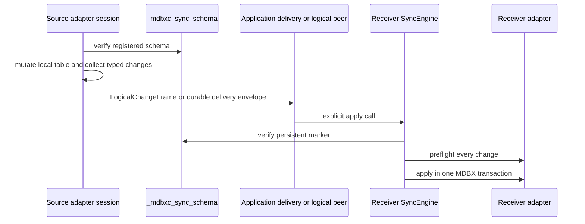
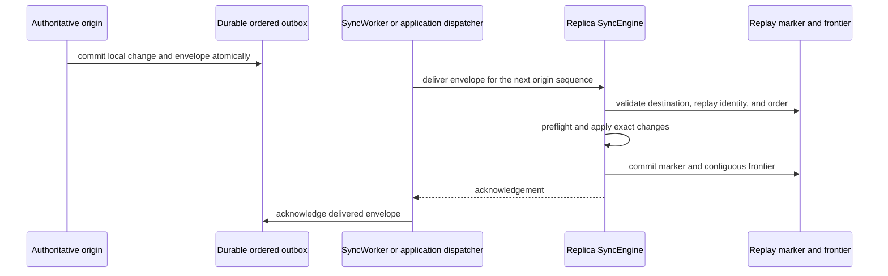

# Logical And Ordered Sync

Logical sync is an opt-in, application-owned protocol for tables whose public
semantics cannot be represented safely as raw MDBX puts and deletes. It uses
an explicit schema marker and adapter-owned payloads. It is not part of the
normal raw `PullRequest` / `PushRequest` wire path.

Read [Sync Replication](sync.md) first. Russian version:
[sync-logical-RU.md](sync-logical-RU.md).

## Lifecycle

1. Choose a stable application `schema_id`, logical table kind, schema version,
   codec tags, and the complete set of owned DBI names.
2. Initialize or verify the schema marker through `SyncEngine`. Existing
   markers are verified, not recreated as an implicit recovery mechanism.
3. Construct matching adapters on the source and destination. Register the
   destination adapter with the destination `SyncEngine`.
4. Perform source writes through the adapter's typed capture session. A
   successful session commit publishes logical changes only after the local
   table mutation succeeds.
5. Deliver a `LogicalChangeFrame` through an application protocol, or commit an
   ordered envelope to the durable outbox with `commit_to_outbox()`.
   `SyncWorkerOptions::enable_logical_delivery` dispatches the latter through a
   logical-capable peer after raw pull pages are drained.
6. Apply on the destination through the matching `SyncEngine` method. Marker
   validation and adapter preflight happen before adapter mutation; failures
   roll back the engine-owned transaction.

The schema marker records the application schema id, kind, version, primary
DBI, and owned DBI set. It protects receivers from accepting a stale in-memory
adapter after a marker migration. Changing codec semantics, schema version, or
owned DBIs requires a new schema identity or an explicit compatible migration;
ordinary registration does not overwrite an existing incompatible marker.

## Direct Logical Frames

`LogicalChangeFrameCodec` serializes an explicit collection of logical
changes. `SyncEngine::apply_logical_frame_bytes()` applies it on the receiver.
This route is appropriate when the application already owns destination
routing, delivery order, and retry policy.

It is intentionally not a retry-safe ordered transport by itself. A frame has
no destination identity, global order, or durable replay identity. Do not use
it as an implicit substitute for raw pull/push or for the ordered-delivery
envelope described below.

The runnable [`sync_23_key_value_logical_frame.cpp`](../examples/sync_23_key_value_logical_frame.cpp)
example shows the complete capture, encode, decode, and apply path for a
`KeyValueTable` adapter.

## Ordered Logical Delivery

`KeyOrderedMultiValueTable` uses a different route because observable append
order is part of its API. A direct logical frame and unordered delivery are
rejected. The schema marker names one non-zero authoritative origin.

The receiver treats a committed redelivery as a successful no-op. A gap or a
mismatched origin is rejected before table mutation. The sender outbox lets an
application retry delivery after process or transport failure without losing
the local ordered history that was committed with the envelope.

Each ordered dispatch targets exactly one receiver node. The wire
`DeliveryRequest` binds that receiver id to the envelope, and the receiver
checks it before replay, frontier, or adapter work; its acknowledgement repeats
the actual receiver id. HTTP and WebSocket accept only this receiver-bound
request for ordered delivery. The legacy envelope-only `Delivery` message is
not an ordered network-delivery route.

In v0.1, one capture/session commit atomically publishes an envelope for one
receiver. Atomic fan-out to several receivers and a peer registry are deferred.
Outbox entries always fit the library-default codec bounds, so a later worker
can decode them without inheriting caller-specific bounds.

`origin_sequence` identifies one logical event for its origin and database; it
is not reallocated for another receiver. Pending delivery and acknowledgement
state remain receiver-specific. Before moving the v0.1 receiver route, recover
the new replica from the current receiver so it imports the origin frontier.
Otherwise its first new delivery is rejected as a sequence gap.

For `DirectSyncPeer`, `HttpSyncPeer`, and `WebSocketSyncPeer`, the optional
worker logical-delivery pass supplies this dispatcher. It runs only when
`SyncWorkerOptions::enable_logical_delivery` is true, only after raw pull pages
are drained, and only for the worker's current `DbId`. The peer first negotiates
ordered delivery and cumulative acknowledgement. Each acknowledged prefix is
removed durably from the sender outbox; an unsupported peer, sequence gap, or
retryable acknowledgement failure leaves the unacknowledged suffix queued.
`max_logical_deliveries` can bound a round, while zero drains the pending
prefix. This remains a separate protocol from raw `PullRequest` / `PushRequest`.

Changing the authoritative origin is an application-coordinated cutover. The
application must quiesce old capture, drain the old outbox, retain replay state
through its retry horizon, migrate the marker on every participant, and only
then enable the new origin. It is not automatic failover and it does not make
two origins concurrently valid for one ordered dataset.

## Implemented Adapter Contracts

| Adapter | Implemented typed contract | Boundary |
| --- | --- | --- |
| `KeyValueTableLogicalAdapter` | Explicit typed capture and apply; `commit_to_outbox()` atomically publishes its ordered envelope. | Direct frames remain manual; ordered outbox delivery needs a capable peer. |
| `KeyTableLogicalAdapter` | Explicit typed capture and apply; `commit_to_outbox()` atomically publishes its ordered envelope. | Direct frames remain manual; ordered outbox delivery needs a capable peer. |
| `VectorStoreLogicalAdapter` | Schema v1 add, erase, and clear across ids, embeddings, text, and metadata DBIs. Explicit IDs are validated before mutation; `commit_to_outbox()` is atomic. | One authoritative or externally serialized writer per collection. |
| `KeyMultiValueTableLogicalAdapter` | v1: insert, version-neutral batch `append()`, key erase, all-matching-value erase, clear. v2 adds exact-one erase and `reconcile()`. v3 adds bounded typed `erase_range()` expanded into exact key erasures. `commit_to_outbox()` is atomic. | Unordered multiset semantics; one writer or causally serialized destructive updates. |
| `KeyOrderedMultiValueTableLogicalAdapter` | v1 append-only ordered delivery. | One authoritative origin. |
| `KeyOrderedMultiValueTableDestructiveLogicalAdapter` | v2 exact append/erase by persistent element ID, bounded selector erasure, clear, and single-origin `replace_with()`. | One authoritative origin; baseline import, multi-origin history, and tombstone compaction are deferred. |

For `KeyMultiValueTable`, repeated equal pairs are a multiset: multiplicity is
preserved, but local iteration order of duplicates is not a cross-node
guarantee. Its direct table calls, raw capture, and unsupported bulk paths stay
local-only. For `KeyOrderedMultiValueTable`, the physical local duplicate
prefix is not a distributed identity; the ordered envelope is the source of
history order.

## Failure And Concurrency Rules

- Validation, planning, or encoding failures before mutation leave a typed
  capture session active unless the adapter documents a storage-integrity
  failure as session-fatal.
- Once a capture/apply failure occurs after mutation, the affected engine or
  session rolls back its MDBX transaction and refuses a later commit when its
  contract requires deactivation.
- There is no general multi-writer convergence contract for destructive logical
  updates. Use one authoritative writer for the affected logical dataset, or
  externally serialize conflicting updates before delivery.
- The logical stores are durable compatibility and delivery state. Do not edit
  `_mdbxc_sync_schema`, replay markers, ordered frontiers, or outbox records
  through application MDBX calls.

## Next Reading

- [Recovery and full snapshots](sync-recovery.md) explains why a raw complete
  snapshot cannot recover a database with persistent logical-sync state.
- [Sync table coverage matrix](../guides/sync-table-coverage.md) contains the
  exhaustive operation-level matrix and deferred boundaries.
