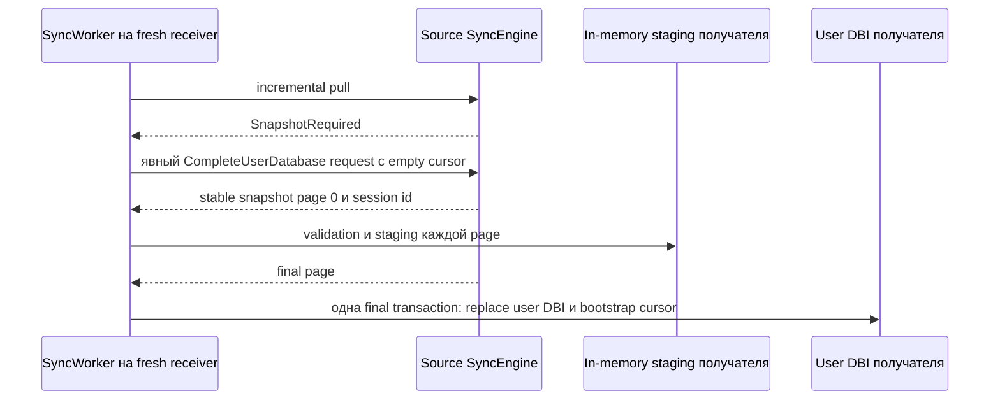

# Восстановление синхронизации и полные снимки

Raw-репликация обычно догоняет источник replay'ем retained changelog batches.
Full snapshot - отдельный явный recovery protocol. Он не равен пустому raw
cursor и не предназначен для ремонта произвольной уже существующей реплики.

Сначала прочитайте [Sync-репликация](sync-RU.md). English version:
[sync-recovery.md](sync-recovery.md).

## Обычное догоняющее применение

Пустой raw cursor запрашивает у источника все *сохранённые* batches начиная с
sequence one. Непустой cursor запрашивает batches новее durable per-origin
cursor получателя. Оба случая - обычный changelog replay.

Если источник уже удалил batch, нужный для продолжения cursor получателя, pull
возвращает `SnapshotRequired` и не отдаёт частичную более позднюю историю.
Получатель должен выбрать recovery procedure, а не применять непрерывно
нарушенный поток.

## Области снимка

| Scope | Выбор источника | Результат на получателе | Эффект для cursor |
| --- | --- | --- | --- |
| `ManifestOnly` | Configured manifest именованных пользовательских DBI. | Заменяет только эти DBI. DBI вне manifest остаются нетронутыми. | Никогда не меняет global raw-sync progress. |
| `CompleteUserDatabase` | Все именованные non-reserved user DBI, видимые в одной stable source read transaction. | Заменяет полный user-DBI inventory fresh receiver. | После финального успешного import записывает immutable source tail в `_mdbxc_applied`. |

`ManifestOnly` - manual physical replacement tool. Он не может bootstrap global
raw cursor и никогда не используется `SyncWorker` как автоматическое recovery.

`CompleteUserDatabase` - единственный worker fallback scope. Destination должен
быть fresh: в нём не может быть user DBI вне exported inventory, local changelog
history либо applied cursor progress. Это не in-place repair path для частично
реплицированной БД.

Получатель проверяет каждую page относительно immutable metadata page zero. До
final page user DBI не изменяются. Interruption либо validation failure удаляет
in-memory staging; persisted importer resume сейчас не реализован, поэтому
последующая попытка начинает новую source session.

## Граница логического состояния

Raw `CompleteUserDatabase` предназначен только для raw sync. Источник отклоняет его
с `SnapshotLogicalStateUnsupported`, когда находит любой persistent logical-sync
state, в том числе:

- logical schema marker;
- logical replay markers либо pruning watermark;
- ordered-delivery frontier;
- durable ordered-outbox metadata либо envelope.

Raw-копия adapter-owned user DBI без logical delivery state не могла бы
безопасно продолжить logical replication. `ManifestOnly` также не обещает
восстановления или bootstrap logical state.

## Logical-aware recovery для fresh replica

`SyncWorkerOptions::enable_logical_recovery_fallback` - отдельный, по
умолчанию выключенный путь для fresh replica после `SnapshotRequired`. Он
использует отдельный peer contract `LogicalRecoveryRequest` /
`LogicalRecoveryResponse` и не меняет raw `PullRequest`, `FullSnapshotChunk`
или raw complete snapshot guard.

`DirectSyncPeer`, `HttpSyncPeer` и `WebSocketSyncPeer` используют один
отдельный wire contract logical recovery. В запросе передаются node requester
и целевой `DbId`; источник отклоняет несовпадающий database до materialization
snapshot. HTTP bearer и WebSocket session identity policy применяют к этому
`DbId` существующее per-principal правило доступа к database.

Источник берёт один stable read baseline, в который входят:

- complete non-reserved user-DBI snapshot и raw applied-cursor tail;
- logical schema markers;
- replay markers и pruning watermarks;
- ordered-delivery receiver frontiers;
- source outbox tail и ещё не подтверждённые envelopes для конкретного
  requesting receiver node.

Pending source suffix непрерывен и заканчивается на known tail этого receiver.
Он не общий с другой репликой, даже если у неё тот же database identity.

У упорядоченного logical event одна глобальная identity на database и origin:
`(DbId, origin_node_id, origin_sequence)`. Source не выделяет новый
`origin_sequence`, когда в v0.1 переносится единственный receiver route. Pending
outbox entries и acknowledgements остаются receiver-specific. Поэтому route с
receiver B на fresh receiver C переносится только через logical-aware recovery
из B в C. Он импортирует ordered frontiers B, после чего C принимает следующий
global event от source. Отправка более позднего event сразу на не
восстановленный C fail-closed отклоняется как ordered sequence gap.

Получатель требует совместимый in-memory adapter для каждой schema из
baseline. Физические страницы staging'уются в памяти. На final page он
проверяет baseline, заменяет user DBI, bootstrap'ит raw cursor,
восстанавливает logical metadata и создаёт replay markers для source
envelopes, которые ещё не были acknowledged. Всё это commit'ится одной MDBX
transaction. Source outbox не копируется как local outbox получателя.

Благодаря этому повторная отправка старого pending source envelope получает
replay acknowledgement, а не второе изменение; следующий source sequence
применяется обычно. Повреждённый baseline, отсутствующий adapter или не fresh
logical state получателя откатывают final transaction.

Source materialization bounds покрывают physical snapshot operations и
учитываемое logical-baseline representation: fixed records, dynamic container
elements и serialized variable payloads. Receiver применяет тот же combined
bound к staged physical pages и final baseline до открытия destination write
transaction. Это structural materialization accounting limit, а не гарантированный
process-heap ceiling: allocator overhead, container capacities и temporary
copies зависят от реализации. `LogicalRecoveryPeer` принимает cooperative
cancellation token для recovery call; cancellation даёт retryable response и
отбрасывает неопубликованную source session. Этот контракт поддерживает
`DirectSyncPeer`.

## Процедура оператора

1. Для новой реплики начните с пустого raw cursor и используйте обычный
   changelog replay, пока источник хранит необходимую историю.
2. Если pull возвращает `SnapshotRequired`, решите, можно ли удалить получатель
   и создать его как fresh replica.
3. Настройте источник на `CompleteUserDatabase` и включите
   `SyncWorkerOptions::enable_full_snapshot_fallback`, либо ведите явный
   snapshot request из application code.
4. Считайте `SnapshotLogicalStateUnsupported` сменой recovery method, а не
   retryable transport error. Для fresh receiver с capable peer используйте
   explicit logical-aware fallback; в остальных случаях нужен
   application-specific logical recovery process.
5. Используйте `ManifestOnly` только тогда, когда замена перечисленных
   физических DBI является нужной application operation и корректно оставить
   global replication cursor без изменений.

## Другие ошибки

| Response | Значение | Обычное действие |
| --- | --- | --- |
| `SnapshotRequired` | Запрошенная raw history больше не сохранена. | Запустите явное fresh-replica recovery, когда это допустимо. |
| `SnapshotNotConfigured` | У источника нет подходящей snapshot export configuration. | Настройте нужный source scope либо выберите другой recovery process. |
| `SnapshotSessionBusy` | Источник достиг bounded active-session capacity. | Повторите позже. |
| `SnapshotSessionInvalid` | Передан expired, foreign либо malformed continuation. | Начните новую snapshot session. |
| `SnapshotLogicalStateUnsupported` | У источника есть durable logical-sync state, который raw complete snapshot не может представить. | Не повторяйте raw snapshot; используйте logical-aware procedure. |

Точную retry classification транспорта, cancellation, TLS, authentication и
production deployment boundaries см. в
[sync-transport-production.md](../guides/sync-transport-production.md).
