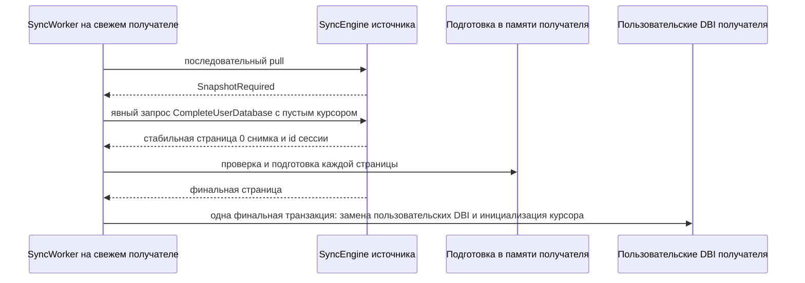

# Восстановление синхронизации и полные снимки

Raw-репликация обычно догоняет источник повторным применением сохранённых
пакетов журнала изменений. Полный снимок — отдельный явный протокол
восстановления. Он не равен пустому raw-курсору и не предназначен для ремонта
произвольной уже существующей реплики.

Сначала прочитайте [Sync-репликация](sync-RU.md). Английская версия:
[sync-recovery.md](sync-recovery.md).

## Обычное догоняющее применение

Пустой raw-курсор запрашивает у источника все *сохранённые* пакеты, начиная с
первого номера последовательности. Непустой курсор запрашивает пакеты новее
постоянного покомпонентного курса origin получателя. Оба случая — обычное
повторное применение журнала изменений.

Если источник уже удалил пакет, нужный для продолжения курсора получателя, pull
возвращает `SnapshotRequired` и не отдаёт частичную более позднюю историю.
Получатель должен выбрать процедуру восстановления, а не применять непрерывно
нарушенный поток.

## Области снимка

| Область | Выбор источника | Результат на получателе | Эффект для курсора |
| --- | --- | --- | --- |
| `ManifestOnly` | Настроенный manifest именованных пользовательских DBI. | Заменяет только эти DBI. DBI вне manifest остаются нетронутыми. | Никогда не меняет общий ход raw-sync. |
| `CompleteUserDatabase` | Все незарезервированные именованные пользовательские DBI, видимые в одной стабильной транзакции чтения источника. | Заменяет полный состав пользовательских DBI свежего получателя. | После финального успешного импорта записывает неизменяемый хвост источника в `_mdbxc_applied`. |

`ManifestOnly` — ручной инструмент физической замены. Он не может инициализировать
общий raw-курсор и никогда не используется `SyncWorker` для автоматического восстановления.

`CompleteUserDatabase` — единственная область резервного восстановления worker.
Получатель должен быть свежим: в нём не может быть пользовательских DBI вне
экспортированного состава, локальной истории журнала изменений либо продвижения
применённого курсора. Это не путь ремонта на месте для частично реплицированной БД.

Получатель проверяет каждую страницу относительно неизменяемых метаданных
нулевой страницы. До финальной страницы пользовательские DBI не изменяются.
Прерывание либо ошибка проверки удаляет подготовленные в памяти данные;
возобновление постоянного импортёра сейчас не реализовано, поэтому последующая
попытка начинает новую сессию источника.

## Граница логического состояния

Raw `CompleteUserDatabase` предназначен только для raw sync. Источник отклоняет
его с `SnapshotLogicalStateUnsupported`, когда находит любое постоянное состояние
logical-sync, в том числе:

- маркер логической схемы;
- маркеры повтора либо watermark очистки;
- границу упорядоченной доставки;
- постоянные метаданные упорядоченного outbox либо envelope.

Raw-копия пользовательского DBI, принадлежащего адаптеру, без состояния
логической доставки не могла бы безопасно продолжить логическую репликацию.
`ManifestOnly` также не обещает восстановления или инициализации логического состояния.

## Восстановление с учётом логического состояния для свежей реплики

`SyncWorkerOptions::enable_logical_recovery_fallback` — отдельный, по умолчанию
выключенный путь для свежей реплики после `SnapshotRequired`. Он использует
отдельный peer-контракт `LogicalRecoveryRequest` / `LogicalRecoveryResponse` и
не меняет raw `PullRequest`, `FullSnapshotChunk` или ограничение полного raw-снимка.

`DirectSyncPeer`, `HttpSyncPeer` и `WebSocketSyncPeer` используют один
отдельный сетевой контракт логического восстановления. В запросе передаются
узел-запросчик и целевой `DbId`; источник отклоняет несовпадающую БД до
материализации снимка. Политика идентичности HTTP bearer и WebSocket session
применяет к этому `DbId` существующее правило доступа к БД для конкретного principal.

Источник берёт одну стабильную базу чтения, в которую входят:

- полный снимок незарезервированных пользовательских DBI и хвост применённых
  raw-курсоров;
- маркеры логических схем;
- маркеры повтора и watermark очистки;
- границы упорядоченной доставки получателя;
- хвост outbox источника и ещё не подтверждённые envelope для конкретного
  узла-получателя, запросившего восстановление.

Ожидающий суффикс источника непрерывен и заканчивается на известном хвосте этого
получателя. Он не общий с другой репликой, даже если у неё та же идентичность БД.

У упорядоченного логического события одна глобальная идентичность на БД и origin:
`(DbId, origin_node_id, origin_sequence)`. Source не выделяет новый
`origin_sequence`, когда в v0.1 переносится единственный маршрут получателя.
Ожидающие записи outbox и подтверждения остаются специфичными для получателя.
Поэтому маршрут с получателя B на свежего получателя C переносится только через
восстановление с учётом логического состояния из B в C. Оно импортирует границы
упорядоченной доставки B, после чего C принимает следующее глобальное событие
от источника. Отправка более позднего события сразу на невосстановленный C
отклоняется как пропуск упорядоченной последовательности.

Получатель требует совместимый адаптер в памяти для каждой схемы из базы
чтения. Физические страницы подготавливаются в памяти. На финальной странице он
проверяет базу чтения, заменяет пользовательские DBI, инициализирует raw-курсор,
восстанавливает логические метаданные и создаёт маркеры повтора для envelope
источника, которые ещё не были подтверждены. Всё это фиксируется одной
MDBX-транзакцией. Outbox источника не копируется как локальный outbox получателя.

Благодаря этому повторная отправка старого ожидающего envelope источника
получает подтверждение повтора, а не второе изменение; следующая
последовательность источника применяется обычно. Повреждённая база чтения,
отсутствующий адаптер или не свежее логическое состояние получателя откатывают
финальную транзакцию.

Ограничения материализации источника покрывают операции физического снимка и
учитываемое представление логической базы: фиксированные записи, динамические
элементы контейнеров и сериализованные нагрузки переменной длины. Получатель
применяет то же объединённое ограничение к подготовленным физическим страницам
и финальной базе до открытия транзакции записи получателя. Это структурное
ограничение учёта материализации, а не гарантированный потолок кучи процесса:
накладные расходы allocator, ёмкости контейнеров и временные копии зависят от
реализации. `LogicalRecoveryPeer` принимает cooperative token отмены для вызова
восстановления; отмена даёт ответ, допускающий повтор, и отбрасывает
неопубликованную сессию источника. Этот контракт поддерживает `DirectSyncPeer`.

## Процедура оператора

1. Для новой реплики начните с пустого raw-курсора и используйте обычное
   повторное применение журнала изменений, пока источник хранит необходимую историю.
2. Если pull возвращает `SnapshotRequired`, решите, можно ли удалить получатель
   и создать его как свежую реплику.
3. Настройте источник на `CompleteUserDatabase` и включите
   `SyncWorkerOptions::enable_full_snapshot_fallback`, либо ведите явный
   запрос снимка из кода приложения.
4. Считайте `SnapshotLogicalStateUnsupported` сменой способа восстановления, а
   не ошибкой транспорта, допускающей повтор. Для свежего получателя с peer,
   поддерживающим этот путь, используйте явное резервное логическое
   восстановление; в остальных случаях нужен процесс восстановления приложения.
5. Используйте `ManifestOnly` только тогда, когда замена перечисленных
   физических DBI является нужной операцией приложения и корректно оставить
   общий курсор репликации без изменений.

## Другие ошибки

| Ответ | Значение | Обычное действие |
| --- | --- | --- |
| `SnapshotRequired` | Запрошенная raw-история больше не сохранена. | Запустите явное восстановление свежей реплики, когда это допустимо. |
| `SnapshotNotConfigured` | У источника нет подходящей настройки экспорта снимка. | Настройте нужную область источника либо выберите другой процесс восстановления. |
| `SnapshotSessionBusy` | Источник достиг ограниченной ёмкости активных сессий. | Повторите позже. |
| `SnapshotSessionInvalid` | Передано устаревшее, чужое либо некорректное продолжение. | Начните новую сессию снимка. |
| `SnapshotLogicalStateUnsupported` | У источника есть постоянное состояние logical-sync, которое полный raw-снимок не может представить. | Не повторяйте raw-снимок; используйте процедуру с учётом логического состояния. |

Точную классификацию повторов транспорта, отмену, TLS, аутентификацию и границы
промышленного развёртывания см. в
[sync-transport-production.md](../guides/sync-transport-production.md).
