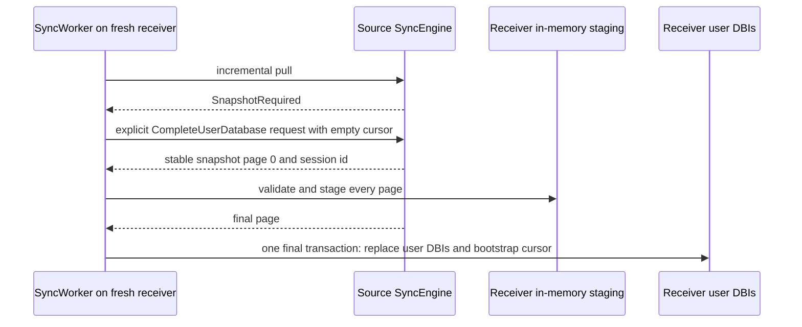

# Sync Recovery And Full Snapshots

Raw replication normally catches up by replaying retained changelog batches.
A full snapshot is a separate, explicit recovery protocol. It is not the same
as an empty raw cursor and it is not a repair tool for an arbitrary existing
replica.

Read [Sync Replication](sync.md) first. Russian version:
[sync-recovery-RU.md](sync-recovery-RU.md).

## Normal Catch-up

An empty raw cursor asks the source for all *retained* batches from sequence
one. A non-empty cursor asks for batches newer than the receiver's durable
per-origin cursor. Both are ordinary changelog replay.

When the source has pruned a batch needed to continue a receiver cursor, pull
returns `SnapshotRequired` and no partial later history. The receiver must
choose a recovery procedure instead of applying a non-contiguous stream.

## Snapshot Scopes

| Scope | Source selection | Destination result | Cursor effect |
| --- | --- | --- | --- |
| `ManifestOnly` | The caller-configured named-user-DBI manifest. | Replaces only those DBIs. DBIs outside the manifest remain untouched. | Never changes global raw-sync progress. |
| `CompleteUserDatabase` | Every named, non-reserved user DBI seen in one stable source read transaction. | Replaces the complete user-DBI inventory of a fresh receiver. | On the final successful import, writes the immutable source tail to `_mdbxc_applied`. |

`ManifestOnly` is a manual physical replacement tool. It cannot bootstrap the
global raw cursor and is never used by `SyncWorker` as automatic recovery.

`CompleteUserDatabase` is the only worker fallback scope. The destination must
be fresh: it cannot already contain user DBIs outside the exported inventory,
local changelog history, or applied cursor progress. It is not an in-place
repair path for a partially replicated database.

The receiver validates every page against immutable page-zero metadata. It
does not mutate user DBIs before the final page. An interruption or validation
failure discards in-memory staging; persisted importer resume is not currently
implemented, so a later retry starts a new source session.

## Logical-State Boundary

`CompleteUserDatabase` is raw-sync-only. The source rejects it with
`SnapshotLogicalStateUnsupported` when it finds any persistent logical-sync
state, including:

- a logical schema marker;
- logical replay markers or a pruning watermark;
- an ordered-delivery frontier;
- durable ordered-outbox metadata or an envelope.

A raw copy of adapter-owned user DBIs without that logical delivery state could
not safely continue logical replication. `ManifestOnly` likewise makes no
claim to repair or bootstrap logical state. A future logical snapshot protocol
must transfer logical schema, replay, ordering, and recovery state atomically.

## Operator Procedure

1. For a newly provisioned replica, start with an empty raw cursor and use
   ordinary changelog replay while the source retains the required history.
2. If a pull returns `SnapshotRequired`, decide whether the receiver can be
   discarded and recreated as a fresh replica.
3. Configure the source for `CompleteUserDatabase` and enable
   `SyncWorkerOptions::enable_full_snapshot_fallback`, or drive the explicit
   snapshot request from application code.
4. Treat `SnapshotLogicalStateUnsupported` as a change of recovery method, not
   as a retryable transport error. Use an application-specific logical recovery
   process instead.
5. Use `ManifestOnly` only when replacing the listed physical DBIs is the
   intended application operation and leaving the global replication cursor
   unchanged is correct.

## Other Errors

| Response | Meaning | Usual action |
| --- | --- | --- |
| `SnapshotRequired` | The requested raw history is no longer retained. | Start an explicit fresh-replica recovery, when applicable. |
| `SnapshotNotConfigured` | The source has no eligible snapshot export configuration. | Configure the intended source scope or use a different recovery process. |
| `SnapshotSessionBusy` | The source reached its bounded active-session capacity. | Retry later. |
| `SnapshotSessionInvalid` | The caller supplied an expired, foreign, or malformed continuation. | Start a new snapshot session. |
| `SnapshotLogicalStateUnsupported` | The source has durable logical-sync state that a raw complete snapshot cannot represent. | Do not retry raw snapshot; use a logical-aware procedure. |

For exact transport retry classification, cancellation, TLS, authentication,
and production deployment boundaries, see
[sync-transport-production.md](../guides/sync-transport-production.md).
