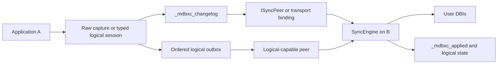
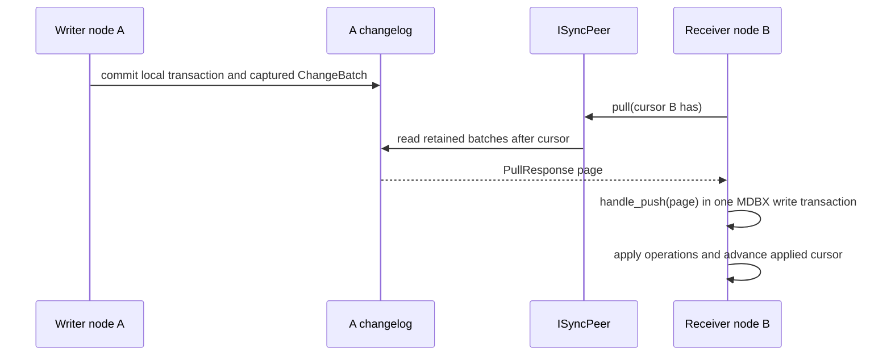

# Sync Replication

`mdbx-containers` provides an opt-in replication subsystem for MDBX-backed
applications. It is transport-agnostic: the core owns capture, durable state,
pagination, validation, and apply transactions; the application chooses an
`ISyncPeer` implementation or one of the optional HTTP/WebSocket bindings.

This guide is the entry point for application developers. It describes the
implemented contract. The wire and disk-format decisions are recorded
separately in [`include/mdbx_containers/sync/DESIGN.md`](../include/mdbx_containers/sync/DESIGN.md).

Russian version: [sync-RU.md](sync-RU.md).

## Choose A Mode

| Need | Mode | Entry points |
| --- | --- | --- |
| Replicate ordinary table writes between database copies | Raw replication | `ThreadLocalChangeAccumulator`, `SyncCaptureScope`, `SyncWorker`, `ISyncPeer` |
| Resolve one mutable key by an upstream source version | Narrow LWW register | `ConflictPolicy::LastWriterWins`, `VersionedKeyValueTable` |
| Replicate a table through an explicit typed application schema | Logical frames | A table logical adapter, `LogicalChangeFrameCodec`, `SyncEngine::apply_logical_frame_bytes()` |
| Preserve one authoritative ordered history and retry its delivery safely | Ordered logical delivery | Durable outbox, logical-capable `ISyncPeer`, `SyncWorkerOptions::enable_logical_delivery` |
| Rebuild a fresh raw replica after changelog retention removed needed history | Full snapshot recovery | `SyncWorkerOptions::enable_full_snapshot_fallback`, `CompleteUserDatabase` |

These modes are deliberately separate. The normal pull/push transport protocol
carries raw DBI operations only. Ordered logical delivery uses a separate
capability-negotiated protocol and is enabled explicitly on `SyncWorker`; it is
not silently converted to raw operations or inserted into a normal
`ChangeBatch`. Direct logical frames remain application-delivered when the
application owns routing, ordering, and retries itself.

## Concepts

- **NodeId** identifies one durable replication participant. Generate it once,
  persist it with the node, and reuse it after restart.
- **DbId** identifies one logical replicated database. Every participant in
  that replication set must use the same value.
- **Origin sequence** orders raw batches from one node. The receiver stores an
  applied cursor per origin and accepts only contiguous new sequences.
- **Capture** records supported local writes in the transaction that made them.
  It does not contact a remote peer during local commit.
- **Apply** is the receiver-side MDBX transaction that validates and commits a
  pulled page, then advances its durable cursor.

## Architecture



The two arrows into `EngineB` represent different admission paths. A raw page
uses `handle_push()`. A direct logical frame uses an explicit logical apply
method. An ordered envelope travels through the logical peer protocol and
additionally checks destination, origin order, replay state, and its persistent
schema marker.

## Raw Replication

Enable sync before including the sync umbrella:

```cpp
#define MDBXC_SYNC_ENABLED 1
#include <mdbx_containers/sync.hpp>
```

The usual setup creates a `SyncEngine` for each connection, initializes a
durable local identity, attaches a `ThreadLocalChangeAccumulator` on writers,
and runs a `SyncWorker` on receivers. `SyncNodeSession` packages the common
application lifecycle of attaching capture and starting an existing worker.



A standalone supported write produces one local batch. Several supported
writes in an explicit connection-managed transaction produce one atomic local
batch. Failed or rolled-back transactions produce no batch.

When capture is attached, writable calls must use `Transaction` or
`Connection::begin()` / `commit()`. Caller-created writable `MDBX_txn*`
handles are rejected before mutation because they cannot invoke the capture
pre-commit hook. Caller-created read-only handles remain suitable for reads
and snapshots.

### Raw Support

| Table family | Raw status | Important boundary |
| --- | --- | --- |
| `KeyValueTable`, `KeyTable`, `ValueTable`, `SequenceTable`, `MetadataTable` | Supported | Operations are captured as raw physical DBI changes. `MetadataTable` preserves its stored type tags. |
| `VectorStore` | Supported through owned tables | Raw replication updates its four underlying DBIs; open instances rebuild the in-memory index lazily after remote apply. |
| `KeyMultiValueTable` | Not raw-replicated | Use its explicit logical adapter when its documented typed contract fits. |
| `KeyOrderedMultiValueTable` | Not raw-replicated | Use ordered logical delivery for its supported schemas. |
| `AnyValueTable`, `HashedKeyValueStore` | Deferred | No raw capture contract exists. |

Raw replication preserves the storage-level operation contract. It is not a
general conflict-resolution system. It rejects sequence gaps. The only
concurrent-write exception is the narrow `VersionedKeyValueTable` register:
with `ConflictPolicy::LastWriterWins`, each point put/delete carries a
non-empty application-owned version that is compared lexicographically, then
by origin `NodeId`. The version remains outside the user value and a durable
sidecar tombstone prevents an older put from resurrecting a delete.

This mode is not generic conflict resolution. `VersionedKeyValueTable` durably
registers only its DBI; every replica must construct the adapter before it
receives revisioned operations. A registered DBI accepts only adapter-emitted
point put/delete changes and rejects direct raw, clear, bulk, and range writes.
Ordinary raw DBIs can coexist on the same LWW engine and continue to accept
unversioned raw operations. Full snapshots may use a manifest of ordinary DBIs,
but cannot include a registered DBI. Choose an upstream sequence or other
canonical authority; node wall-clock time is not an authority. See
[deployment patterns](sync-deployment-patterns.md) for the operational model.

## Transport And Operations

`DirectSyncPeer` is the in-process peer used by the introductory examples.
Framework-neutral HTTP and WebSocket seams use `TransportMessageCodec`; the
optional Simple-Web and Kurlyk bindings supply concrete transports without
changing core messages.

### Ordered Logical Delivery

`ISyncPeer` also exposes an optional logical-delivery capability. `DirectSyncPeer`,
`HttpSyncPeer`, and `WebSocketSyncPeer` implement it. HTTP uses dedicated
logical hello and delivery routes; WebSocket distinguishes the logical protocol
by its own magic. Neither transport changes `TransportMessageCodec` or the raw
pull/push wire layout.

Set `SyncWorkerOptions::enable_logical_delivery = true` to dispatch the local
engine's durable outbox after a round has drained raw pull pages. The worker
uses the current replication `DbId` as the logical destination, negotiates
ordered delivery and cumulative acknowledgements, and removes only the
acknowledged outbox prefix. `max_logical_deliveries` optionally bounds one
round; zero drains the pending prefix. A raw-only peer is accepted while the
outbox is empty, but produces a failed round without deleting queued frames
when delivery is pending. Retryable acknowledgement failures likewise retain
the unacknowledged suffix for the next round.

Transport authentication, TLS, remote-address policy, rate limiting, request
ids, and HTTP/WebSocket status mapping are adapter-local. They are intentionally
not serialized inside replication DTOs. Operational setup is covered by
[sync-transport-production.md](../guides/sync-transport-production.md).

Useful runnable starting points:

- [`sync_01_lifecycle_direct_peer.cpp`](../examples/sync_01_lifecycle_direct_peer.cpp): one manual raw pull/push cycle.
- [`sync_22_node_session_minimal.cpp`](../examples/sync_22_node_session_minimal.cpp): minimal `SyncNodeSession` wiring.
- [`sync_07_worker_observer.cpp`](../examples/sync_07_worker_observer.cpp): worker status and callbacks.

## Next Reading

- [Sync use cases](sync-use-cases.md): choose a supported contract for one
  writer, immutable multi-origin events, LWW registers, and RAG corpus data.
- [Deployment patterns](sync-deployment-patterns.md): data models and writer
  ownership for multi-origin datasets.
- [Logical and ordered delivery](sync-logical.md): typed schemas, adapter
  capture, ordered outbox delivery, and concurrency boundaries.
- [Recovery and full snapshots](sync-recovery.md): retained-history recovery,
  snapshot scopes, and fresh-replica rules.
- [Sync table coverage matrix](../guides/sync-table-coverage.md): the exact
  operation-level support and deferred work.
- [Sync examples](../examples/README-sync.md): build commands and a guided
  example sequence.
